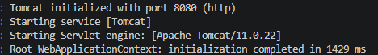
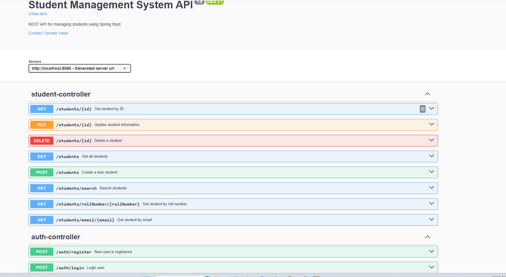
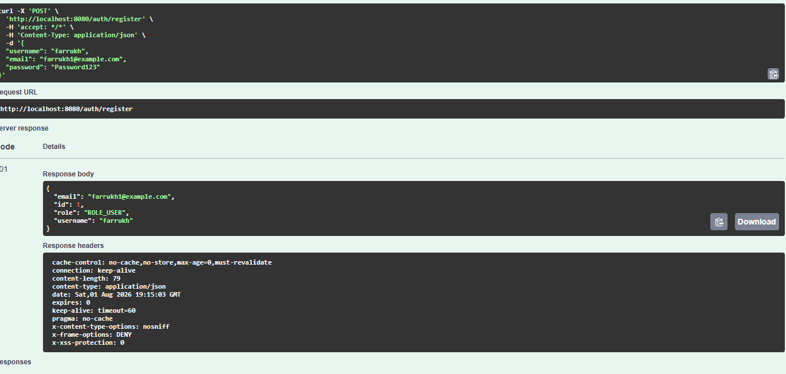
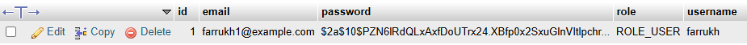
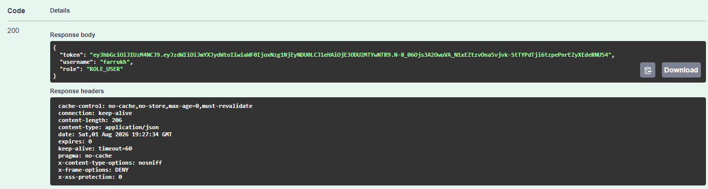
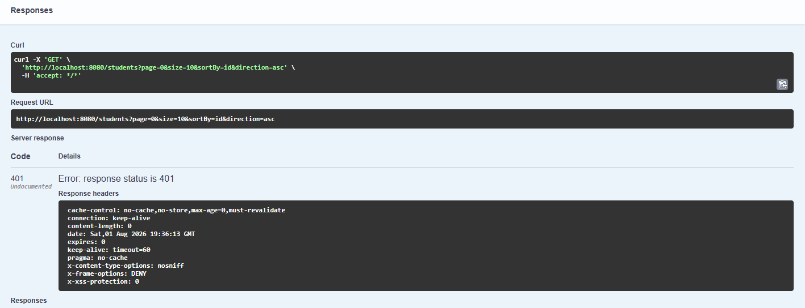
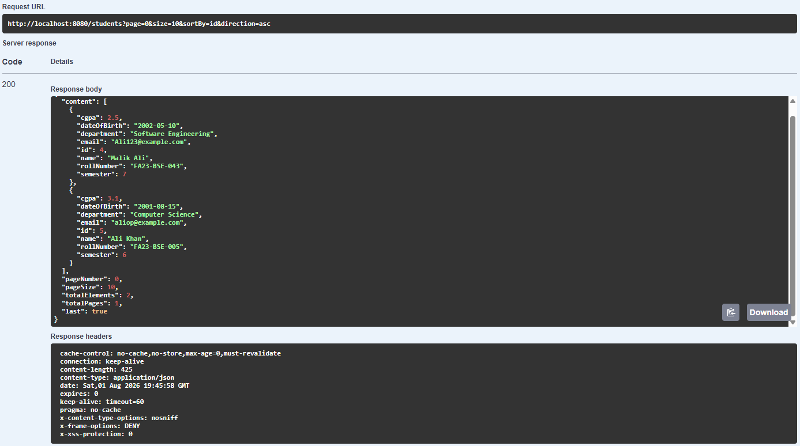

# Student Management System


A secure REST API for managing student records, built with Spring Boot, Spring Security, JWT authentication, JPA, MySQL, and Swagger/OpenAPI.

## Features

- Create, read, update, and delete students
- Search students by name or email
- Find students by ID, email, or roll number
- Pagination and sorting
- Request validation
- Global exception handling
- User registration
- BCrypt password hashing
- JWT-based login and authentication
- Stateless Spring Security configuration
- Protected API endpoints
- Swagger/OpenAPI documentation
- Swagger Bearer authorization

## Technology Stack

- Java 17
- Spring Boot 4.1.0
- Spring Security
- JSON Web Token
- Spring Data JPA
- Hibernate
- MySQL / MariaDB
- Maven
- Swagger / OpenAPI

## Project Structure

```text
src/main/java/com/farrukh/studentmanagement
├── config
├── controller
├── dto
├── entity
├── exception
├── repository
└── service
```

## Authentication Flow

1. Register a user using `/auth/register`.
2. Login using `/auth/login`.
3. Receive a JWT token.
4. Click **Authorize** in Swagger.
5. Paste the JWT token.
6. Access protected student endpoints.

## API Endpoints

### Authentication

| Method | Endpoint | Description |
|---|---|---|
| POST | `/auth/register` | Register a new user |
| POST | `/auth/login` | Login and receive a JWT |

### Students

| Method | Endpoint | Description |
|---|---|---|
| GET | `/students` | Get paginated students |
| GET | `/students/{id}` | Get student by ID |
| GET | `/students/email/{email}` | Get student by email |
| GET | `/students/rollNumber/{rollNumber}` | Get student by roll number |
| GET | `/students/search` | Search students |
| POST | `/students` | Create a student |
| PUT | `/students/{id}` | Update a student |
| DELETE | `/students/{id}` | Delete a student |

## Running the Project

### Prerequisites

- Java 17
- Maven
- MySQL or MariaDB
- A database named `student_db`

### Database Configuration

Update `src/main/resources/application.properties`:

```properties
spring.application.name=student-management-system

spring.datasource.url=jdbc:mysql://localhost:3306/student_db
spring.datasource.username=root
spring.datasource.password=

spring.jpa.hibernate.ddl-auto=update

jwt.secret=${JWT_SECRET:replace-this-with-a-long-development-secret-key}
jwt.expiration=3600000
```

For production, store the JWT secret in an environment variable instead of committing a real secret.

### Start the Application

```bash
mvn spring-boot:run
```

The API runs at:

```text
http://localhost:8080
```

Swagger UI:

```text
http://localhost:8080/swagger-ui/index.html
```

## Screenshots

### Application Running



### Swagger API Overview



### User Registration



### BCrypt Password Storage



### Successful JWT Login



### Protected Endpoint Without Token



### Protected Endpoint With JWT



## Security Behavior

- `/auth/register` and `/auth/login` are public.
- Swagger documentation endpoints are public.
- Student endpoints require a valid JWT.
- Missing or invalid authentication returns `401 Unauthorized`.
- Passwords are stored as BCrypt hashes.
- Server sessions are disabled because authentication is stateless.

## Future Improvements

- JUnit and Mockito tests
- Integration tests
- Docker and Docker Compose
- Refresh tokens
- Role-based authorization
- Database migrations with Flyway
- CI/CD pipeline
- Deployment

## Author

**Farrukh Yasin**

GitHub: [paperface4](https://github.com/paperface4)